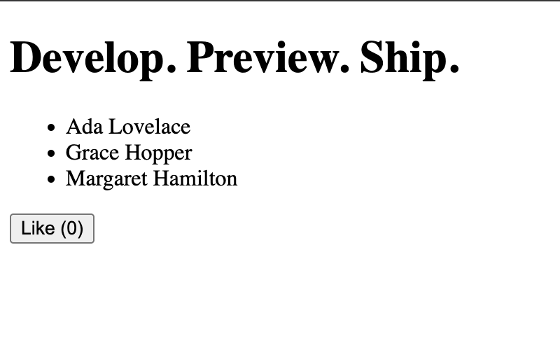

# README

## Description

There are notes I took while following the Next.js tutorial [React Foundations](https://nextjs.org/learn/react-foundations). I started with an empty directory and created files as instructed. I noticed the tutorial was written for older versions of React and Next.js which introduced some problems later on.

## Technologies used

- JavaScript
- React 18
- React DOM 18
- Next.js 14

## Project setup

Everything went smoothly while using the `react` and `react-dom` scripts from [unpkg.com](unpkg.com).

### Take 1

I then created a new project using `npm` and modified the source code as instructed.

When I ran the development server I got the expected syntax error, but I noticed the file `layout.js` was not automatically created inside the `app` folder. I've read that's because Next.js 19 defaults to the older Pages Router instead of the newer App Router.

I haven't formally learned about either router yet, so to follow the tutorial as written I tried recreating the project using React and React DOM 18:

### Take 2

- Deleted `node_modules` and `.next` folders
- Deleted `package-lock.json`

```sh
npm install react@18 react-dom@18 next@latest
```

That didn't fix the problem either. The versions of React and React DOM were 18.3.1, which is the same as the tutorial, so I realized the version 16 of Next was too recent for the tutorial.

### Take 3

This time I deleted the same files and manually edited `package.json` to install the following versions (straight from the tutorial):

```json
{
  "scripts": {
    "dev": "next dev"
  },
  "dependencies": {
    "next": "^14.0.3",
    "react": "^18.3.1",
    "react-dom": "^18.3.1"
  }
}
```

That solved the problem and the file `app/layout.js` was created by the dev server.

## Screenshot


